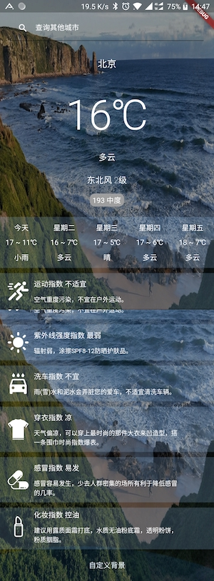
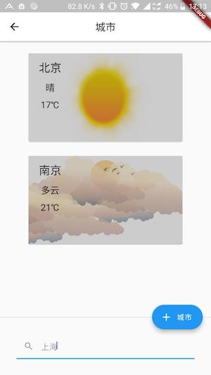

### Muses是一款用Flutter编写的天气预报应用，代码会持续更新...

使用api为魅族天气api，感谢 [https://github.com/jokermonn/-Api]()

### 功能
* 支持全国地级市天气预报
* 未来五天天气预报查看
* 支持生活指数查看
* 支持自定义更换背景
* 保存城市天气列表
* 下拉刷新城市列表

### 未完成
* 保存一系列背景根据天气情况动态更换
* 小时级天气曲线图
* 定位自动更新天气

目前还在学习中，还没有使用一些框架，之后随着功能不断完善会对代码进行重构。

apk 下载：

